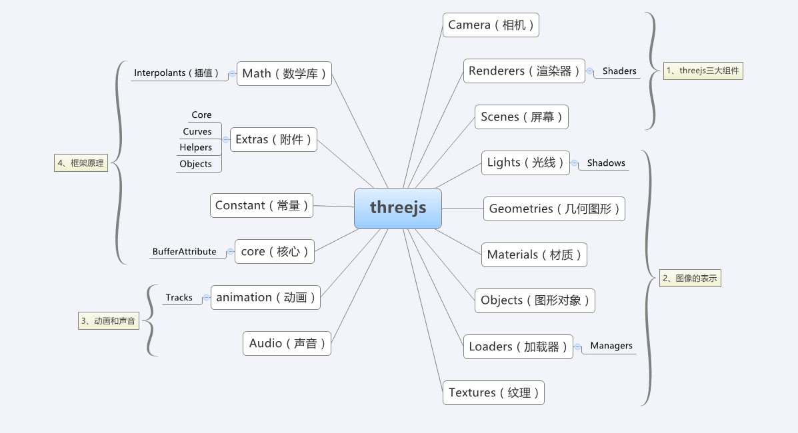

# 快速开始

## 一、简单说下

Three.js 是基于WebGL标准并对原本复杂的API进行了极大的简化，同时也是目前GitHub上3D框架中star数最高的，非常推荐前段开发人员使用。本文档只讲解基础通用部分，其他更深入的内容可以查看[Three.js官网API文档](https://threejs.org/docs/index.html#manual/en/introduction/Creating-a-scene)

Three.js的核心内容有如下这些




我们可以从Camera Renderers Scenes开始 一步步深入了解其他模块

## 二、先跑起来

先来段简单的代码，跑起来看看是什么样子

### 1.看下代码
``` html
<div id="box"></div>
```

``` css
#box{
  background-color: #000;
  height: 500px;
  width: 800px
}
```

``` js
// 实例化场景
// 场景是用来放置光源和网格化模型的
let scene = new THREE.Scene()
// 获取承载dom
// 就是用来包裹canvas的元素
let dom = document.getElementById('box')
// 实例化透视摄像机
let camera = new THREE.PerspectiveCamera(60, 800 / 500, 0.1, 700)
// 设置摄像机位置
camera.position.x = 3
camera.position.y = 5
camera.position.z = 5
// 设置摄像机朝向 朝向原点
camera.lookAt(new THREE.Vector3(0, 0, 0))
// 实例化渲染器 用webGL来渲染
let renderer = new THREE.WebGLRenderer()
// 渲染器的背景色
renderer.setClearColor(0x000000)
// 设置渲染的canvas的大小
renderer.setSize(800, 500)
// 创建几何体
let geometry = new THREE.BoxBufferGeometry(2, 2, 2)
// 创建材质
let material = new THREE.MeshBasicMaterial( {color: 0x00ff00} )
// 生成网格化模型
let mesh = new THREE.Mesh( geometry, material )
// 加入场景中
scene.add(mesh)
// 把canvas挂载到dom上
dom.appendChild(renderer.domElement)
// 渲染一帧
renderer.render(scene, camera)
```

### 2.生成效果

<iframe height='357' scrolling='no' title='jvKdJM' src='//codepen.io/kuminson/embed/jvKdJM/?height=357&theme-id=0&default-tab=result&embed-version=2' frameborder='no' allowtransparency='true' allowfullscreen='true' style='width: 100%;'>See the Pen <a href='https://codepen.io/kuminson/pen/jvKdJM/'>jvKdJM</a> by kuminson (<a href='https://codepen.io/kuminson'>@kuminson</a>) on <a href='https://codepen.io'>CodePen</a>.</iframe>

### 3.解释下代码

THREE.js首先要有三样东西，scene(场景)、camera(摄像机)、renderer(渲染器)

scene用来放置网格化模型，camera用来调整观看视角，renderer把前两个渲染到canvas里

## 三、接着转起来

增加简单动画效果

### 1.代码

``` js
// 动画函数
function anima () {
  // box绕y轴旋转
  box.rotation.y += 0.01
  // 渲染一帧
  renderer.render(scene, camera)
  // 渲染
  requestAnimationFrame(anima)
}
// 运行动画函数
anima()
```

### 2.效果

<iframe height='362' scrolling='no' title='转起来' src='//codepen.io/kuminson/embed/jvKgQR/?height=362&theme-id=0&default-tab=result&embed-version=2' frameborder='no' allowtransparency='true' allowfullscreen='true' style='width: 100%;'>See the Pen <a href='https://codepen.io/kuminson/pen/jvKgQR/'>转起来</a> by kuminson (<a href='https://codepen.io/kuminson'>@kuminson</a>) on <a href='https://codepen.io'>CodePen</a>.
</iframe>

### 3.解释

上面我们用这段代码来实现渲染一帧

``` js
renderer.render(scene, camera)
```

那么只要渲染很多帧，且每帧都改变一点位置或者角度，就能形成动画了。

主要用的是h5方法requestAnimationFrame(),他可以根据显示器的帧率来自动调节每秒渲染次数，一般是60帧每秒。比setTimeOut要便捷的多。